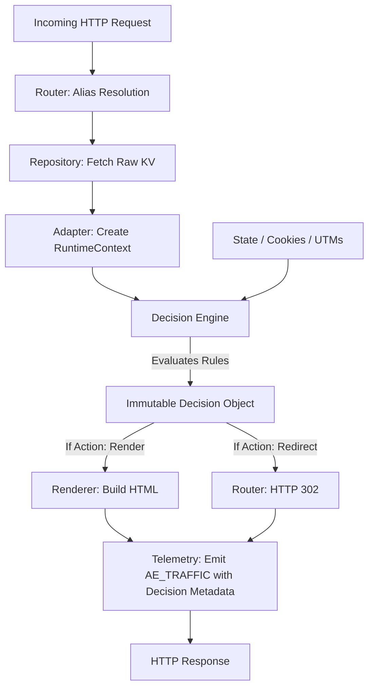

# CogniLink Decision Engine V2 (Architecture Contract)

This document defines the architectural contract for the Next-Generation Decision Engine. The Decision Engine is a domain-agnostic, pure computation layer responsible for evaluating contextual signals and generating a deterministic, immutable `Decision` object.

It replaces the legacy hard-coded redirect logic, scoring, and coupling with the renderer.

---

## 1. Karar Motorunun Görevi (Single Responsibility Principle)

Decision Engine'in yegane görevi **karar üretmektir**. 
- Sistemdeki mevcut `RuntimeContext`'i, kullanıcı durumunu (State) ve tanımlanmış kuralları (Rules) girdi olarak alır.
- Hangi kuralın eşleştiğini değerlendirir.
- Sonuçta sadece bir `Decision` objesi döner.

**Asla yapmadığı şeyler:**
- HTML veya Component render etmez.
- HTTP Redirect (301/302) HTTP Response fırlatmaz.
- Veritabanından, KV'den veya Cloudflare ortamından (Env) dış veri çekmez (fetch yapmaz).
- Analytics Engine'e doğrudan event yollamaz.

---

## 2. Girdiler (Inputs)

Decision Engine, değerlendirme yapabilmek için tüm veriyi dışarıdan bağımsız objeler halinde alır. Hiçbir side-effect içermez (Pure Function).

1. **`RuntimeContext`**: (Zorunlu) Adapter'dan gelen `campaignContext`, `pageContent`, `activeLinks` ve metadata. Kuralların (Decision Rules) kendisi bu objenin içinden beslenir.
2. **`StateContext`**: (Zorunlu) Kullanıcının o anki durumu. (Session ID, geçmiş etkileşim tagleri, utm_source, utm_medium vb.)
3. **`EnvironmentContext`**: (Opsiyonel) Saat, dil (locale), cihaz tipi (mobile/desktop), A/B experiment aktifliği gibi sinyaller.

*Girmeyenler:* Raw KV verisi, Cloudflare `request` objesi, `env` bindings, HTML stringleri.

---

## 3. Çıktı (The Immutable Decision Object)

Decision Engine değerlendirmesini bitirdiğinde tek bir, değiştirilemez (immutable) obje döner. Renderer ve Telemetry katmanları sadece bu objeyi okur.

```typescript
type Decision = {
  decision_id: string;        // Hangi kural seti/engine kullanılarak bu karar verildi
  matched_rule_id: string;    // Eşleşen spesifik kuralın ID'si (veya "default")
  action: "render" | "redirect" | "api_response" | "block";
  target: string | null;      // Redirect URL'si veya Render edilecek Page ID
  state_mutations: {          // Decision'ın tetiklediği State değişimleri (Örn: "soft_score" = +1)
    tags_to_add: string[];
    tags_to_remove: string[];
  };
  render_overrides: {         // Renderer'a giden opsiyonel direktifler
    layout_variant?: string;
    hidden_components?: string[];
    theme_override?: string;
  };
  telemetry_flags: {          // Analytics Engine'e gönderilecek ek etiketler
    is_conversion: boolean;
    experiment_exposure: boolean;
  };
};
```

*Gereksiz hiçbir alan (örneğin HTML stringi, HTTP headers) bu objede bulunmaz.*

---

## 4. Kural Sistemi (Rule Model)

Eski sistemdeki *Hot Score*, *Soft Score*, *Time Rules* gibi koda gömülü ve platforma sıkı sıkıya bağlı (Kartra vs. Hub) konseptler, **Kural Tabanlı (Rule-Based)** veya **Expression-Based** modele evrilir.

**Yeni Kural Anatomisi (JSON Rules):**
Sistem, pipeline bazlı, önceliklendirilmiş (priority-based) kural setleri çalıştırır.

```json
{
  "rules": [
    {
      "id": "rule_high_intent",
      "priority": 100,
      "condition": {
        "and": [
          { "state.tags": { "contains": "watched_vsl" } },
          { "context.utm_medium": { "equals": "email" } }
        ]
      },
      "outcome": {
        "action": "redirect",
        "target": "https://checkout.cognilink.com/..."
      }
    },
    {
      "id": "rule_default",
      "priority": 0,
      "condition": "always",
      "outcome": {
        "action": "render",
        "target": "current_page"
      }
    }
  ]
}
```

- **Conflict Resolution (Çakışma Çözümü):** Her kural bir `priority` değerine sahiptir. En yüksek öncelikli kural eşleştiğinde motor durur (**Stop Rule** mantığı).
- Eğer hiçbir kural eşleşmezse, sistem daima bir `Fallback/Default Rule` üzerinden `action: "render"` döner.

---

## 5. State Model

Kullanıcının durumu (State) birçok katmandan oluşur, ancak Decision Engine'e giren State çok nettir:

- **Behavior State (Girmez/Bılmaz):** Sitedeki scroll, mouse hareketi gibi saniyelik ham data. Decision Engine bunu işlemez.
- **Session/Journey State (Girer):** Kullanıcının hangi tag'lere ("clicked_cta", "viewed_pricing") sahip olduğu. Decision Engine'in ana yakıtıdır.
- **Lead State (Girer):** "Bu kullanıcı lead formunu doldurdu mu?" (Bolean veya Tag olarak).
- **Identity (Girmez):** E-posta adresi, ad-soyad gibi PII verileri karar mekanizmasına asla girmez (Güvenlik ve SoC). Sadece anonim `uid` ve tag'ler girer.

---

## 6. Sınırlar ve İlişkiler (Boundaries)

### RuntimeContext İlişkisi
Decision Engine, `RuntimeContext`'i sadece salt-okunur (read-only) bir sözlük (dictionary) olarak kullanır. İçindeki `decision_rules` dizisini okur ve motoru çalıştırır.

### Renderer İlişkisi
Sınır kesin bir çizgiyle çizilmiştir: 
**Decision Engine Renderer'a emir vermez, niyet (intent) bildirir.**
Renderer, Decision objesindeki `action: "render"` komutunu gördüğünde, yine aynı objenin içindeki `render_overrides` (örn: gizlenecek komponentler) listesine göre HTML'i çizer. Eğer `action: "redirect"` ise, Renderer **hiç çalışmaz**, router katmanı doğrudan HTTP 302/301 döner.

### Telemetry İlişkisi
Decision Engine, AE'ye direkt veri yazmaz. Ürettiği `Decision` objesi Router tarafından alınır. Router, bu objenin içindeki `decision_id`, `matched_rule_id` ve `telemetry_flags` gibi değerleri okur ve tek bir standart JSON halinde `AE_TRAFFIC` veya `AE_CONVERSION`'a (Telemetry Pipeline) fırlatır.

---

## 7. Gelecek Entegrasyonlar (Future Horizons)

Bu domain-agnostic mimari sayesinde, sisteme sonradan eklenecek olan motorlar (Engines), sadece Decision Engine'in girdi veya kural setlerini genişleterek sisteme dahil olur:

- **Journey Engine:** Kullanıcıyı bir funnel'da adım adım ilerletmek için, Decision Engine'e `journey_step` state'i gönderir. Engine de buna karşılık sıradaki sayfayı `redirect` target olarak döner.
- **Experiment Engine (A/B Tests):** Kural setine girmeden önce, Experiment Engine varyantı seçer ve bunu State objesine yazar. Decision Engine bu varyanta göre UI override kuralını işletir.
- **AI Personalization:** Yapay zeka, kullanıcıya özel bir kural dizisi (veya JSON rule subset) üretebilir. Decision Engine bu kural setini standart bir şekilde evaluate eder.

---

## 8. Decision Hayatı (Lifecycle Pipeline)


