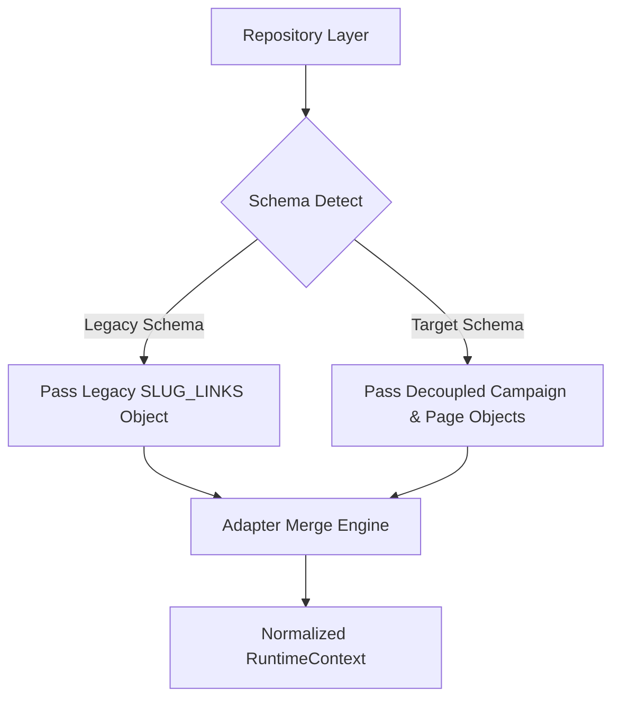
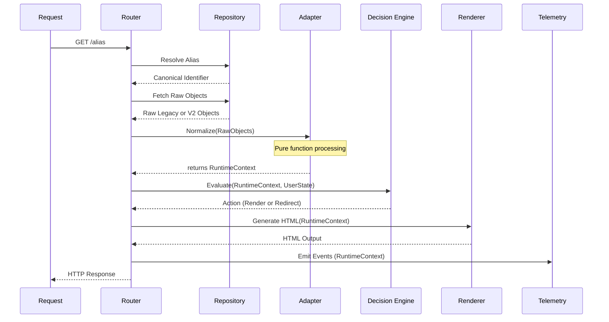

# CogniLink Runtime Adapter (Compatibility Layer)

This document defines the architectural contract for the Runtime Adapter, a critical compatibility layer designed to safely bridge the legacy coupled data model (`Campaign` + `Landing` inside `SLUG_LINKS`) and the new decoupled target model (`Campaign` ➔ `target_page_id` ➔ `Landing`).

This is a permanent reference document intended to guide the implementation and maintenance of the adapter layer until the legacy data model is fully deprecated.

---

## 1. Adapter Responsibility

**Sorumluluğu (Responsibility):**
The Runtime Adapter is a pure normalization engine. Its sole responsibility is to take raw data objects fetched by the Repository layer (whether legacy or modern schemas), merge them, apply default values, and produce a single, unified contract for the rest of the application.

**Neyi Bilir (What it knows):**
- It knows the internal structure of both the legacy `SLUG_LINKS` schema and the new decoupled `APP_CONFIG` schemas.
- It knows how to resolve conflicts and fallback rules (e.g., extracting layout from legacy records if `target_page_id` is missing).
- It knows how to construct the standardized `RuntimeContext`.

**Neyi Bilmez (What it doesn't know):**
- **It does NOT know how to read from KV or any other data store.** KV access is strictly delegated to the Repository layer.
- It has zero knowledge of the HTTP Request or Response objects.
- It knows nothing about the Decision Engine rules, HTML rendering logic, or Analytics Engine (AE) telemetry.
- It does not mutate or write data.

**Hangi Katmanlarla Konuşur (Interacting Layers):**
- **Downstream (Receives input from):** Repository Layer (which handles KV/Cache fetching).
- **Upstream (Outputs to):** Routing core, Decision Engine, Renderer, and Telemetry via the unified `RuntimeContext`.

---

## 2. Normalization Flow

---

## 3. Legacy Resolution Sequence

When the Repository passes a legacy record to the adapter, the normalization sequence is:

1. **Campaign Context Extraction:** Parse UTM defaults, tracking codes, and status from the legacy root level.
2. **Virtual Page Construction:** Create an ephemeral `Page` object in memory, mapping the `customHeaderHtml`, `customStyleCss`, `links`, and `components` to the new `Page` schema.
3. **Component Consolidation:** Ensure legacy component references are structured to match the new `RuntimeContext` expectations.
4. **Merge:** Package the extracted Campaign context and the virtual Page object into the final `RuntimeContext`.

---

## 4. Adapter Relationships in the New Model

How the adapter interacts with the broader ecosystem:

- **Page & Campaign:** The adapter guarantees valid `Page` and `Campaign` objects are present in the context, even if synthesized from legacy data.
- **Alias:** The adapter receives canonical identifiers from the Repository but does not resolve aliases itself.
- **Experiment (A/B):** The adapter normalizes data for the specific variant resolved by the A/B router upstream.
- **Session & Lead:** The adapter passes through state requirements but does not manage session cookies or lead states directly.
- **Decision Engine & Journey Engine:** The adapter provides the standardized input payload (`RuntimeContext`) that these engines require.

---

## 5. The Normalized Output: `RuntimeContext`

The adapter must always return a strictly typed `RuntimeContext` object.

**İçinde Olması Gereken Alanlar (Included Fields):**
- `campaignContext`: `{ id, name, utm_defaults, status }`
- `pageContent`: `{ id, title, layout, components, custom_css, custom_html }`
- `activeLinks`: Array of resolved, merged, and sorted links.
- `render_mode`: `canonical` | `campaign` | `experiment` | `preview` | `redirect` (Used by Renderer and Journey Engine).
- `metadata`: 
  - `source_schema`: `legacy` | `v2`
  - `runtime_version`: `legacy` | `adapter` | `future` (Crucial for migration and compatibility checks).

**İçinde Olmaması Gereken Alanlar (Excluded Fields):**
- Raw HTTP request data, Cloudflare `context`, or `env` objects.
- Deprecated legacy keys (e.g., `headerText`, `footerText`) — these must be mapped and dropped.
- Data fetching logic or promises.

---

## 6. Adapter Lifecycle

---

## 7. Deprecation Strategy (Legacy Sunset)

When the legacy `SLUG_LINKS` model is fully deprecated:

- **Silinecek Parçalar (What gets deleted):**
  - The legacy normalization logic inside the Adapter.
  - The virtual `Page` synthesis from legacy fields.
  - Legacy KV read fallbacks in the Repository layer.
- **Değişmeyecek Parçalar (What stays unchanged):**
  - The routing core (`[[path]].js`).
  - The Decision Engine.
  - The Renderer (`hub-renderer.js`).
  - The `RuntimeContext` contract. Because these layers only depend on the Adapter's output, they require zero code changes when legacy is dropped.

---

## 8. Performance and Caching Strategy

**Cache Stratejisi (Caching Strategy):**
- `RuntimeContext` **MUST NOT** be cached.
- Caching must occur at the **Repository Layer** for individual entities (e.g., `Campaign cache`, `Page cache`).
- **Neden (Why):** Merging a `Campaign` and a `Page` into a `RuntimeContext` via the Adapter is a fast, synchronous, CPU-bound operation. Caching the final `RuntimeContext` would lead to cache key explosion (combinatorial explosion of every Campaign × Page × Experiment Variant × Render Mode combination), consuming excessive Workers memory and severely dropping the cache hit rate. Caching granular entities ensures high hit rates and low memory usage.

---

## 9. Public Contract

**Runtime'ın Beklentileri (What runtime expects):**
- A synchronous pure function signature: `function normalizeContext(rawObjects, options)`
- Consistent data structure regardless of the underlying schema.

**Adapter'ın Garantileri (What adapter guarantees):**
- **Schema Guarantee:** The output will always match the `RuntimeContext` definition.
- **Default Guarantee:** Missing fields will be safely defaulted (e.g., empty arrays for missing links).
- **Deterministic Guarantee:** The adapter is a pure function. Given the same input `rawObjects` and options, it will *always* produce the exact same `RuntimeContext`. It utilizes zero hidden state, no random variables, and no implicit I/O.
- **Safety Guarantee:** No mutating operations or external network calls (KV/Cache) will be executed by the adapter.

---

## 10. Implementation Roadmap

The adapter migration must follow a strictly verifiable path:

1. **Adapter Skeleton:** Define the pure functions and `RuntimeContext` typings.
2. **Unit Tests:** Extensively test the adapter with mock legacy and v2 data inputs.
3. **Shadow Mode:** Run the adapter alongside the existing legacy pipeline in production without altering the response.
4. **Legacy vs Adapter Output Comparison:** Automatically diff the legacy output against the adapter's `RuntimeContext` output in Shadow Mode and log discrepancies.
5. **Metrics Comparison:** Verify that AE events triggered by the `RuntimeContext` payload exactly match the baseline metrics.
6. **Cutover:** Switch the routing core, Decision Engine, and Renderer to consume `RuntimeContext` exclusively.
