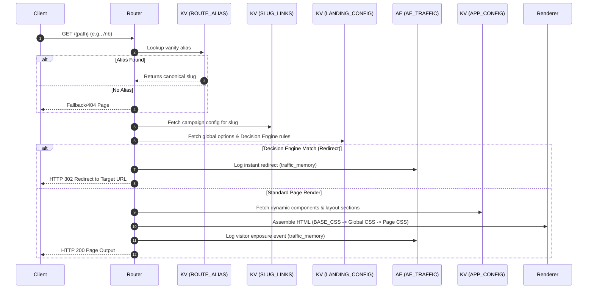

# CogniLink Runtime System Architecture Guide

This document serves as the permanent system architecture reference guide for the CogniLink campaign router, page rendering, and telemetry engine.

---

## 1. SYSTEM PURPOSE
CogniLink Runtime is a high-performance web campaign router and dynamic HTML renderer deployed on Cloudflare Pages. Its responsibilities are:
- Resolving shorthand vanity aliases into target campaign slugs.
- Rendering fast, responsive campaign and landing pages using server-side rendering (SSR) templates.
- Executing behavior-driven Decision Engine routing algorithms at the edge.
- Dispatching operational telemetry events to the Cloudflare Analytics Engine (AE) to feed the administrative dashboard.
- Tracking split testing (A/B) variants.

---

## 2. CORE ENTITIES

- **Page / Landing:**
  - *Current:* Dynamic component layout blocks rendered under campaign configurations.
  - *Proposed:* Decoupled page records with independent schemas and paths (see [runtime_data_model.md](file:///Users/ekinyasa/Coding/projects/claude/cognilink-runtime-pages-app/runtime_data_model.md)).
- **Campaign:**
  - *Current:* Core attribution context tying slugs, destination links, and UTM defaults.
  - *Proposed:* Independent marketing context pointing to target pages via `target_page_id`.
- **Alias:**
  - *Current:* Vanity shortcuts (e.g. `/nb`) resolving to canonical campaign slugs.
- **Component:**
  - *Current:* Reusable HTML/CSS blocks stored in `APP_CONFIG`.
- **Experiment:**
  - *Current:* Variant traffic split configurations mapped under `AB_INDEX`.
- **Session:**
  - *Pending:* Behavior state cookie context tracking conversions and flow transitions.
- **Lead:**
  - *Pending:* Form outcome and consent records captured at conversion points.
- **Event:**
  - *Current:* Telemetry points logged under `traffic_memory` / `ab_selected`.
  - *Proposed:* Standardized `page_view` and `conversion` contract events.
- **Decision Engine:**
  - *Current:* Edge rules engine executing instant redirects based on client parameters.
- **Health Check:**
  - *Current:* Infrastructure checks probing router paths (`/nb`), KV namespaces, and AE connectivity.

---

## 3. REQUEST FLOW

---

## 4. KV BINDING MAP

| Binding Name | Storage Target | Key Formats | Read Files | Write Files | Admin Module | Source of Truth? |
|---|---|---|---|---|---|---|
| `SLUG_LINKS` | Campaign configuration | `{slug_name}` | `[[path]].js`, `c/[slug].js` | `api/slug/index.js`, `api/slug/[slug].js` | Slugs Editor | Yes |
| `CAMPAIGN_INDEX` | Campaign fast lookups | `{campaign_name}` | Router matching | Campaign Manager | Campaign APIs | No (Secondary index) |
| `LANDING_CONFIG` | Global settings | `hub_config`, `engine_config` | `hub-renderer.js` | `api/config.js` | General Settings | Yes |
| `ROUTE_ALIAS` | Vanity route mapping | `route:{alias}` | `alias-router.js` | Routes Manager | Routes API | Yes |
| `APP_CONFIG` | Dynamic components | `comp_family:{id}`, `comp_ver:{id}:{ver}` | `components-test.js` | `api/admin/components.js` | Components Tab | Yes |
| `ANALYTICS_DATA` | Report caches | Cached summaries | Analytics dashboard | Background tasks | Analytics API | No (Derived data) |
| `AB_INDEX` | Split-test mappings | `ab_config:{alias}` | `ab-router.js` | Experiment Manager | Experiments API | Yes |
| `GUARD_CACHE` | Security locks | Gate records | Middleware | Security guards | Internal only | No (Ephemeral cache) |

---

## 5. ANALYTICS ENGINE BINDING MAP

- **`AE_TRAFFIC`**:
  - *Production Name:* `cognilink_runtime_traffic_prod`
  - *Yazma Noktası:* `ops-telemetry.js` (`emitOps`)
  - *Sorgulama Noktası:* `api/admin/analytics.js`
  - *Schema:* `index1` = event name, `blob1` = alias, `blob2` = canonical_slug, `blob3` = modifier, `blob4` = campaign, `blob5` = reason.

- **`AE_CONVERSION`**:
  - *Production Name:* `cognilink_runtime_conversion_prod`
  - *Yazma Noktası:* `analytics.js`
  - *Sorgulama Noktası:* `api/admin/analytics.js`
  - *Schema:* `index1` = action (`click` or `conversion`), `blob1` = alias, `blob2` = slug, `blob3` = source.

- **`AE_EXPERIMENT`**:
  - *Production Name:* `cognilink_runtime_experiment_prod`
  - *Yazma Noktası:* `t.js`
  - *Sorgulama Noktası:* `api/experiments.js`
  - *Schema:* `index1` = experiment_name, `blob1` = variant, `blob2` = user_id.

---

## 6. EVENT CONTRACT

| Event Name | Producer | Dataset | Context | index1 | blob1 | blob2 | blob3 | blob4 |
|---|---|---|---|---|---|---|---|---|
| `traffic_memory` | Wildcard router | `AE_TRAFFIC` | Routing Success | `traffic_memory` | alias | canonical_slug | modifier | campaign |
| `ab_selected` | Experiment router | `AE_TRAFFIC` | Split-testing | `ab_selected` | alias | variant_slug | - | campaign |
| `click` | Outbound CTA | `AE_CONVERSION` | Marketing Action | `click` | alias | slug | source | - |
| `conversion` | User Opt-in / Leads | `AE_CONVERSION` | Marketing Conversion | `conversion` | alias | slug | source | - |

---

## 7. ENVIRONMENT AND BINDING MATRIX

- **Local Development:**
  - *KV Source:* Local Wrangler sqlite bindings.
  - *AE Source:* Mocked console outputs (since AE is not local).
  - *Configuration:* `.dev.vars` file.
- **Production Environment:**
  - *KV Source:* Cloudflare Dashboard Bindings (`cl_runtime_*` namespaces).
  - *AE Source:* Live Production Datasets (`*_prod`).
  - *Configuration:* Cloudflare Pages Settings variables.

---

## 8. SOURCE OF TRUTH
- **KV Bindings:** The **Cloudflare Dashboard binding** is the final source of truth. Definitions in `wrangler.toml` only apply locally or during wrangler deployments.
- **Entity Namespaces:** `cl_runtime_*` namespaces map the live system state.

---

## 9. KNOWN ASSUMPTIONS
- Canonical campaign slugs are persistent and unique.
- Custom CSS injected at page level is rendered exactly as defined (scoping is disabled).
- Local testing relies on `.dev.vars` configurations rather than global variables.

---

## 10. KNOWN LIMITATIONS
- Wildcard router matches bots and logs them under `traffic_memory` with dummy names (e.g. `wp-admin`).
- Telemetry events for landing pages are tied directly to campaigns; landing page standalone views are not separately tracked yet (`Pending`).

---

## 11. DIAGNOSTIC CHECKLIST
1. Verify if projenin **Deployments** panelinden **Redeploy** tetiklendi mi?
2. `CF_ACCOUNT_ID` ve `CF_AE_API_TOKEN` değişkenleri doğru mu?
3. `ROUTE_ALIAS` KV üzerinde `nb` rotası tanımlı mı?
4. AE SQL sorgusu doğru veri seti adlarını (`cognilink_runtime_traffic_prod`) hedefliyor mu?

---

## 12. RECOVERY PROCEDURES
See [connection_guide.md](file:///Users/ekinyasa/Coding/projects/claude/cognilink-runtime-pages-app/connection_guide.md) for step-by-step instructions on rebuilding deleted KV namespaces or AE datasets.

---

## 13. DOCUMENT MAINTENANCE RULES
Sistem mimarisini, binding yapısını, event sözleşmesini, route akışını, health check varsayımlarını veya entity ilişkilerini değiştiren her geliştirme, ilgili markdown rehberleri güncellenmeden tamamlanmış sayılmaz.

- **Last Updated:** 2026-07-16
- **Status:** Evaluated
- **Related Files:** [connection_guide.md](file:///Users/ekinyasa/Coding/projects/claude/cognilink-runtime-pages-app/connection_guide.md), [health_issues.md](file:///Users/ekinyasa/Coding/projects/claude/cognilink-runtime-pages-app/health_issues.md), [runtime_data_model.md](file:///Users/ekinyasa/Coding/projects/claude/cognilink-runtime-pages-app/runtime_data_model.md)
- **Related Bindings:** `SLUG_LINKS`, `AE_TRAFFIC`, `AE_CONVERSION`
