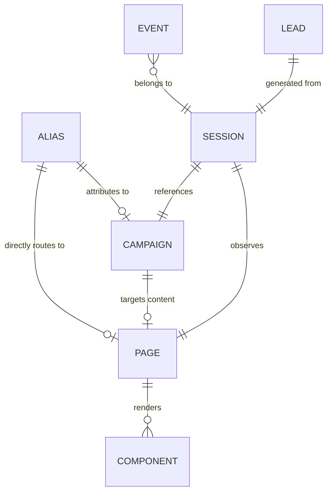

# CogniLink Runtime System Data Model Design

This document details the target data model contract and lifecycle rules to transition CogniLink from a campaign-centric routing layout to a decoupled Page-Campaign relationship.

---

## 1. PURPOSE
The goal of this data model is to establish a modular, decoupled data schema where **Landing Pages** act as self-contained content & conversion containers, and **Campaigns** act as temporary, attribution-focused distribution contexts.

---

## 2. CURRENT MODEL
Currently, CogniLink is highly campaign-centric:
- **Pages/Landings** are nested directly inside campaign configurations under `SLUG_LINKS` (key: `{slug}`). The page content, links, custom styles, custom HTML, and the campaign parameters are tied in a single record.
- **Components** (`comp_family`, `comp_ver`) are managed inside `APP_CONFIG`.
- **Experiments** are defined under `AB_INDEX` (key: `ab_config:{alias}`).
- **Sessions** and **Leads** do not have dedicated database collections; sessions exist transiently in client-side cookies/sessionStorage, and leads are inferred solely from event streams.

---

## 3. TARGET MODEL
We propose decoupling the schemas so that content lives independently from marketing campaigns.

---

## 4. ENTITY DEFINITIONS

### PAGE [Proposed]
Represents the content layer (HTML, CSS, JS, layout, metadata).
- `id` (UUID): Primary identifier.
- `slug` (String): URL path segment.
- `title` (String): Page display title.
- `page_type` (Enum): `canonical_landing`, `campaign_variant`, `static`, `legal`.
- `product` (String): Associated product category (e.g., `sigorta`).
- `intent` (String): Conversion target (e.g., `lead_generation`).
- `status` (Enum): `draft`, `active`, `inactive`, `archived`.
- `layout` (JSON): Ordered structural blocks.
- `components` (Array): Reference IDs of child components.
- `custom_css` (String): Unscoped raw style blocks.
- `custom_html` (String): Raw body injection scripts.
- `seo_config` (JSON): Metadata tag overrides.
- `created_at` / `updated_at` / `published_at` (Timestamp)

### CAMPAIGN [Proposed]
Represents marketing traffic parameters and target destinations.
- `id` (UUID): Primary identifier.
- `name` (String): Campaign name.
- `status` (Enum): `draft`, `scheduled`, `active`, `paused`, `ended`, `archived`.
- `source` / `medium` / `campaign_code` (String): Core attribution presets.
- `target_page_id` (UUID): Reference target page.
- `start_at` / `end_at` (Timestamp): Active duration windows.
- `attribution_defaults` (JSON): Fallback parameters for routing.

### ALIAS / ROUTE [Current / Proposed]
Represents vanity alias redirects or direct entries.
- `alias` (String, PK): Short URL identifier.
- `target_type` (Enum): `page`, `campaign`, `redirect`, `experiment`.
- `target_id` (String): Primary ID matching target type.
- `status` (Enum): `active`, `inactive`, `expired`.

### SESSION [Proposed]
- `session_id` (UUID): Unique session tracker.
- `utm_source` / `utm_medium` / `utm_campaign` (String): Attribution tags.
- `experiment_id` / `variant_id` (String): Split-testing allocations.
- `converted` (Boolean): Conversion signal status.
- `created_at` / `last_seen_at` (Timestamp)

### LEAD [Proposed (Phase 2)]
- `lead_id` (UUID): Primary identifier.
- `session_id` (UUID): Referral session context.
- `page_id` (UUID): Submission origin page.
- `product` / `intent` (String): Category context.
- `quote_data` (JSON): Flexible form collection fields.
- `status` (Enum): `new`, `contacted`, `quoted`, `won`, `lost`.

---

## 5. STORAGE AND SOURCE OF TRUTH
- **PAGE & CAMPAIGN:** Handled in a new or unified `APP_CONFIG` prefix mapping.
- **ALIAS:** Key-value pairs inside `ROUTE_ALIAS`.
- **SESSION:** Managed via hybrid client sessionStorage + encrypting cookies to keep the edge stateless.

---

## 6. LIFECYCLE RULES

- **Page transitions:**
  `draft` ➔ `active` ➔ `inactive` ➔ `archived` (Archived is soft-deleted).
- **Campaign transitions:**
  `draft` ➔ `scheduled` ➔ `active` ➔ `paused` ➔ `ended` (Transitions to ended on expiration).

---

## 7. URL AND ROUTING MODEL
- **Canonical page:** `/c/{slug}` or `/{slug}` (No attribution parameters required).
- **Campaign alias:** `/{alias}` (Translates destination, assigns session cookies, and redirects/renders).

---

## 8. EVENT CONTRACT

All telemetry sent to Analytics Engine (`AE_TRAFFIC` / `AE_CONVERSION` / `AE_EXPERIMENT`) will be sharded dynamically using:
- **`traffic_memory`** (Ingestion): `index1` = event, `blob1` = alias, `blob2` = page_id, `blob3` = campaign_id, `blob4` = session_id.
- **`conversion`**: `index1` = action, `blob1` = page_id, `blob2` = session_id, `blob3` = source.

---

## 9. MIGRATION STRATEGY

- **Phase A — Adapter Layer:** Add fallback readers. If `target_page_id` is missing on a campaign, normalizer maps to the legacy `slugData` attributes.
- **Phase B — Decouple Config:** Migrate layout items from `SLUG_LINKS` to `APP_CONFIG` under the `page:` key mapping.
- **Phase C — Unified Events:** Upgrade logging pipeline to record both page and campaign contexts.

---

## 10. BACKWARD COMPATIBILITY
- Router resolving pipeline fallback check: If target ID cannot be resolved, fall back to matching route values directly to avoid breaks.

---

## 11. FIRST IMPLEMENTATION MILESTONE
- **Objective:** Add target page reference lookup on Campaign entities without modifying the rendering or tracking pipelines.
- **Scope:**
  - Add optional `target_page_id` field to campaign config.
  - Update Admin campaign editor UI to select target page.
  - Implement resolver normalizer in `[[path]].js`.

---

## 12. DOCUMENT METADATA
- **Last Updated:** 2026-07-16
- **Status:** Proposed
- **Related Files:** [runtime_architecture.md](file:///Users/ekinyasa/Coding/projects/claude/cognilink-runtime-pages-app/runtime_architecture.md)
- **Related Bindings:** `SLUG_LINKS`, `APP_CONFIG`
